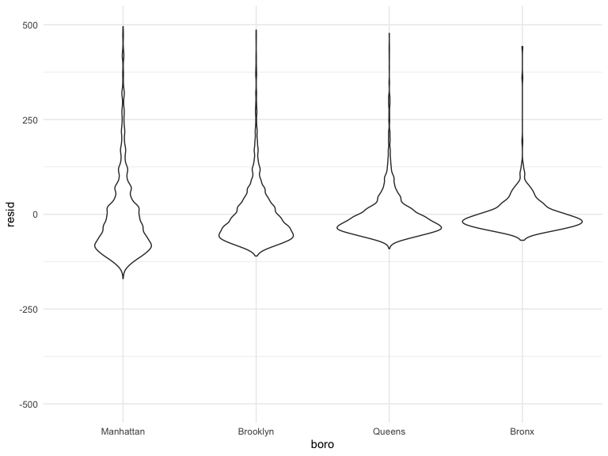
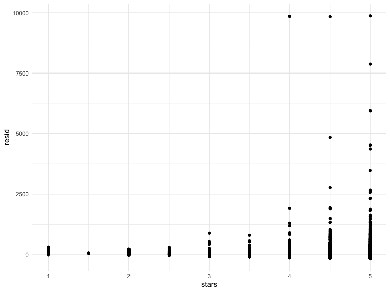
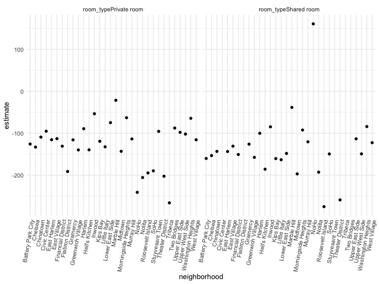

linear\_models
================
Tanu
11/7/2019

``` r
library(tidyverse)
library(p8105.datasets)

set.seed(1)
```

``` r
data("nyc_airbnb")

nyc_airbnb = 
  nyc_airbnb %>% 
  mutate(stars = review_scores_location / 2) %>% 
  rename(
    boro = neighbourhood_group,
    neighborhood = neighbourhood) %>% 
  filter(boro != "Staten Island") %>% 
  select(price, stars, boro, neighborhood, room_type)
```

# fit a first linear model

``` r
fit = lm(price ~ stars + boro, data = nyc_airbnb)
```

``` r
fit

summary(fit)
coef(fit)
summary(fit)$coef
```

tidy the results instead\!

``` r
fit %>% 
  broom::tidy() %>% 
  select(term, estimate, p.value) %>% 
  mutate(term = str_replace(term, "^boro", "Boro: ")) %>% 
  knitr::kable(digits = 3)
```

| term            | estimate | p.value |
| :-------------- | -------: | ------: |
| (Intercept)     | \-70.414 |   0.000 |
| stars           |   31.990 |   0.000 |
| Boro: Brooklyn  |   40.500 |   0.000 |
| Boro: Manhattan |   90.254 |   0.000 |
| Boro: Queens    |   13.206 |   0.145 |

``` r
fit %>% 
  broom::glance()
```

    ## # A tibble: 1 x 11
    ##   r.squared adj.r.squared sigma statistic   p.value    df  logLik    AIC
    ##       <dbl>         <dbl> <dbl>     <dbl>     <dbl> <int>   <dbl>  <dbl>
    ## 1    0.0342        0.0341  182.      271. 6.73e-229     5 -2.02e5 4.04e5
    ## # … with 3 more variables: BIC <dbl>, deviance <dbl>, df.residual <int>

## Take a look at factors…

``` r
nyc_airbnb=
  nyc_airbnb %>% 
  mutate(
    boro = fct_infreq(boro),
    room_type = fct_infreq(room_type)
  )
```

``` r
fit= lm(price ~ stars + boro, data = nyc_airbnb)

fit %>% 
  broom::tidy()
```

    ## # A tibble: 5 x 5
    ##   term         estimate std.error statistic   p.value
    ##   <chr>           <dbl>     <dbl>     <dbl>     <dbl>
    ## 1 (Intercept)      19.8     12.2       1.63 1.04e-  1
    ## 2 stars            32.0      2.53     12.7  1.27e- 36
    ## 3 boroBrooklyn    -49.8      2.23    -22.3  6.32e-109
    ## 4 boroQueens      -77.0      3.73    -20.7  2.58e- 94
    ## 5 boroBronx       -90.3      8.57    -10.5  6.64e- 26

``` r
modelr::add_residuals(nyc_airbnb, fit) %>% 
  ggplot(aes(x = boro, y = resid)) + 
  geom_violin() +
  ylim(-500,500)
```



``` r
modelr::add_residuals(nyc_airbnb, fit) %>% 
  ggplot(aes(x = stars, y = resid)) + 
  geom_point() 
```



## Nesting

``` r
fit_interaction = lm(price ~ stars * boro + room_type * boro, data = nyc_airbnb) 
fit_interaction %>% 
  broom::tidy()
```

    ## # A tibble: 16 x 5
    ##    term                               estimate std.error statistic  p.value
    ##    <chr>                                 <dbl>     <dbl>     <dbl>    <dbl>
    ##  1 (Intercept)                           95.7      19.2     4.99   6.13e- 7
    ##  2 stars                                 27.1       3.96    6.84   8.20e-12
    ##  3 boroBrooklyn                         -26.1      25.1    -1.04   2.99e- 1
    ##  4 boroQueens                            -4.12     40.7    -0.101  9.19e- 1
    ##  5 boroBronx                             -5.63     77.8    -0.0723 9.42e- 1
    ##  6 room_typePrivate room               -124.        3.00  -41.5    0.      
    ##  7 room_typeShared room                -154.        8.69  -17.7    1.42e-69
    ##  8 stars:boroBrooklyn                    -6.14      5.24   -1.17   2.41e- 1
    ##  9 stars:boroQueens                     -17.5       8.54   -2.04   4.09e- 2
    ## 10 stars:boroBronx                      -22.7      17.1    -1.33   1.85e- 1
    ## 11 boroBrooklyn:room_typePrivate room    32.0       4.33    7.39   1.55e-13
    ## 12 boroQueens:room_typePrivate room      54.9       7.46    7.37   1.81e-13
    ## 13 boroBronx:room_typePrivate room       71.3      18.0     3.96   7.54e- 5
    ## 14 boroBrooklyn:room_typeShared room     47.8      13.9     3.44   5.83e- 4
    ## 15 boroQueens:room_typeShared room       58.7      17.9     3.28   1.05e- 3
    ## 16 boroBronx:room_typeShared room        83.1      42.5     1.96   5.03e- 2

``` r
nyc_airbnb %>%  
  filter(boro == "Brooklyn") %>%  
  lm(price ~ stars + room_type, data = .) %>% 
  broom::tidy()
```

    ## # A tibble: 4 x 5
    ##   term                  estimate std.error statistic   p.value
    ##   <chr>                    <dbl>     <dbl>     <dbl>     <dbl>
    ## 1 (Intercept)               69.6     14.0       4.96 7.27e-  7
    ## 2 stars                     21.0      2.98      7.05 1.90e- 12
    ## 3 room_typePrivate room    -92.2      2.72    -34.0  6.40e-242
    ## 4 room_typeShared room    -106.       9.43    -11.2  4.15e- 29

## Let’s try to map this

``` r
nyc_airbnb %>% 
  nest(data = -boro) %>% 
  mutate(
    models = map(.x = data, ~lm(price ~ stars + room_type, data = .x )), 
    results = map(models, broom::tidy)
  ) %>% 
  select(boro, results) %>% 
  unnest(boro, results)
```

    ## # A tibble: 16 x 6
    ##    boro      term                  estimate std.error statistic   p.value
    ##    <fct>     <chr>                    <dbl>     <dbl>     <dbl>     <dbl>
    ##  1 Bronx     (Intercept)              90.1      15.2       5.94 5.73e-  9
    ##  2 Bronx     stars                     4.45      3.35      1.33 1.85e-  1
    ##  3 Bronx     room_typePrivate room   -52.9       3.57    -14.8  6.21e- 41
    ##  4 Bronx     room_typeShared room    -70.5       8.36     -8.44 4.16e- 16
    ##  5 Queens    (Intercept)              91.6      25.8       3.54 4.00e-  4
    ##  6 Queens    stars                     9.65      5.45      1.77 7.65e-  2
    ##  7 Queens    room_typePrivate room   -69.3       4.92    -14.1  1.48e- 43
    ##  8 Queens    room_typeShared room    -95.0      11.3      -8.43 5.52e- 17
    ##  9 Brooklyn  (Intercept)              69.6      14.0       4.96 7.27e-  7
    ## 10 Brooklyn  stars                    21.0       2.98      7.05 1.90e- 12
    ## 11 Brooklyn  room_typePrivate room   -92.2       2.72    -34.0  6.40e-242
    ## 12 Brooklyn  room_typeShared room   -106.        9.43    -11.2  4.15e- 29
    ## 13 Manhattan (Intercept)              95.7      22.2       4.31 1.62e-  5
    ## 14 Manhattan stars                    27.1       4.59      5.91 3.45e-  9
    ## 15 Manhattan room_typePrivate room  -124.        3.46    -35.8  9.40e-270
    ## 16 Manhattan room_typeShared room   -154.       10.1     -15.3  2.47e- 52

## Let’s nest neighborhoods

``` r
nyc_airbnb %>% 
  filter (boro == "Manhattan") %>% 
  nest(data = -neighborhood) %>% 
  mutate(
    models = map(.x = data, ~lm(price ~ stars + room_type, data = .x )), 
    results = map(models, broom::tidy)
  ) %>% 
  select(neighborhood, results) %>% 
  unnest(neighborhood, results)
```

    ## # A tibble: 123 x 6
    ##    neighborhood     term              estimate std.error statistic  p.value
    ##    <chr>            <chr>                <dbl>     <dbl>     <dbl>    <dbl>
    ##  1 Battery Park Ci… (Intercept)         -119.      366.     -0.324 7.48e- 1
    ##  2 Battery Park Ci… stars                 74.0      74.2     0.997 3.27e- 1
    ##  3 Battery Park Ci… room_typePrivate…   -126.       27.6    -4.56  8.11e- 5
    ##  4 Battery Park Ci… room_typeShared …   -160.       56.3    -2.84  7.96e- 3
    ##  5 Chinatown        (Intercept)          337.       60.4     5.59  5.66e- 8
    ##  6 Chinatown        stars                -27.8      13.0    -2.14  3.34e- 2
    ##  7 Chinatown        room_typePrivate…   -109.       11.5    -9.52  1.03e-18
    ##  8 Chinatown        room_typeShared …   -143.       93.2    -1.54  1.25e- 1
    ##  9 Chelsea          (Intercept)          477.      135.      3.53  4.38e- 4
    ## 10 Chelsea          stars                -44.5      27.3    -1.63  1.04e- 1
    ## # … with 113 more rows

``` r
manhattan_nest_lm_results = 
  nyc_airbnb %>% 
  filter (boro == "Manhattan") %>% 
  nest(data=-neighborhood) %>% 
  mutate(
    models = map(.x = data, ~lm(price ~ stars + room_type, data = .x )), 
    results = map(models, broom::tidy)
  ) %>% 
  select(neighborhood, results) %>% 
  unnest(neighborhood, results)
```

``` r
manhattan_nest_lm_results %>% 
  filter(str_detect(term, "room_type")) %>% 
  ggplot(aes(x = neighborhood, y = estimate)) + 
  geom_point() + 
  facet_wrap(~term) + 
  theme(axis.text.x = element_text(angle = 80, hjust = 1))
```



``` r
nyc_airbnb %>% 
  filter(neighborhood == "NoHo", room_type == "Shared room")
```

    ## # A tibble: 1 x 5
    ##   price stars boro      neighborhood room_type  
    ##   <dbl> <dbl> <fct>     <chr>        <fct>      
    ## 1   219     4 Manhattan NoHo         Shared room
